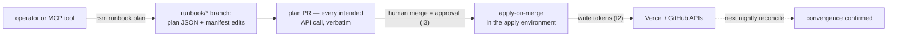
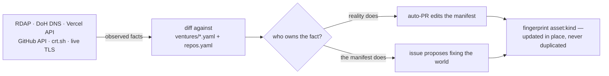
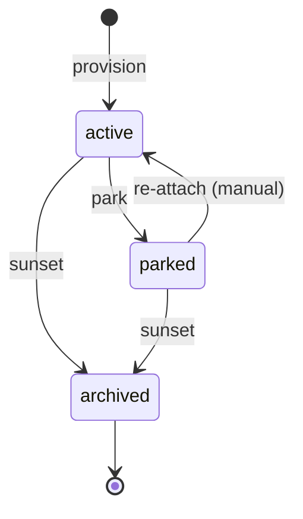

<div align="center">

# 🌱 rootsmith

**Control plane for a serial-venture digital footprint.**

Declarative venture manifests · nightly drift reconciliation · PR-gated mutation runbooks

*Treesmith works the trees; rootsmith tends what's underneath.*

[](https://github.com/smithdak/rootsmith/actions/workflows/ci.yml)
[](https://github.com/smithdak/rootsmith/actions/workflows/drift-nightly.yml)


[Quickstart](#-quickstart) · [How it works](#-how-a-change-to-the-world-happens) · [CLI](#-cli-at-a-glance) · [MCP](#-mcp-server) · [Wiring](#-wiring-checklist) · [Docs](#-documentation-map)

</div>

---

One repository holds the desired state of every venture's digital assets — domains, DNS, repos, deploys, email routes — diffs it nightly against observed reality, and changes the world only through human-approved, PR-gated runbooks.

| 📖 Declare | 🔍 Reconcile | 🔐 Mutate |
|:---|:---|:---|
| One YAML manifest per venture — the system of record (I1) | Nightly diff against RDAP, DNS, Vercel, GitHub, crt.sh, live TLS | Plan PRs only: merging **is** the approval; write tokens exist only in the `apply` environment |

> [!IMPORTANT]
> Seven design invariants govern every module, and the code cites them by number (`I1`–`I7`). Read [SPEC.md §1](./SPEC.md#1-design-invariants) before touching anything.

<details>
<summary><b>The seven invariants, abbreviated</b> — full statements in the spec</summary>
<br/>

| # | Invariant | One line |
|:--|:--|:--|
| **I1** | Manifest is the system of record | An asset observed at a provider but absent from every manifest is drift, never tolerated silently |
| **I2** | Reads and writes are credential-separated | Scheduled jobs hold read tokens; write tokens exist only in the `apply` environment |
| **I3** | Every mutation is a plan first | Runbooks emit a PR describing each intended API call; merging it *is* the approval |
| **I4** | Reconcile only what is programmatically readable | Social handles and the like are inert documentation fields — recorded, never drift-checked |
| **I5** | Drift is two-tier | Reality-owned facts auto-PR the manifest; manifest-owned facts file an issue to fix the world |
| **I6** | Provider volatility is isolated behind adapters | RDAP is the universal degraded mode; the nightly run degrades, never breaks |
| **I7** | Identity and credentials are outside the automation path | Humans execute credential operations; no exception is planned or plannable |

</details>

## ⚡ Quickstart

```sh
npm install
npm run cli -- status                  # every venture, every domain, urgency flags surfaced
npm run cli -- renewals --within 90    # exits 1 if anything is expired
npm run cli -- drift                   # live RDAP + DNS + cert reconciliation — no tokens needed
```

<details>
<summary>What <code>status</code> prints against the bundled example manifests</summary>

```text
acme  [active]  dns_policy=observed
  acme.example         vercel      canonical renews=2027-03-01 basis=rdap
  acme-app.example     vercel      redirect  renews=2027-03-01 basis=rdap

northwind  [parked]  dns_policy=observed
  northwind.example    unknown     parked    renews=?          basis=manual     << FINDING
```

This public copy ships fictional ventures on RFC 2606-reserved `.example` domains; a real deployment keeps its portfolio in a [private ops fork](#-running-it-for-real).

</details>

> [!TIP]
> `alias rsm="npm run cli --"` — `rs` collides with common tooling. The rest of the docs use `rsm`.

The wider surface, same pattern:

```sh
rsm status --live                                   # joins observed expiry + nameservers per domain
rsm repos                                           # owned GitHub repos x venture / registry claims
rsm drift --deep --report                           # nightly form: crt.sh sweep, files issues + auto-PRs
rsm runbook plan park acme                          # opens a plan PR — NEVER executes (I3)
rsm runbook plan provision zephyr --domain zephyr.dev   # venture new, one gated flow
rsm runbook plan sunset acme --release
rsm runbook plan archive-repos                      # enforce repos.yaml disposition: archive
npm run mcp                                         # MCP server on stdio
```

## 🔁 How a change to the world happens

There is exactly one path from *intent* to *mutation*, and it runs through a pull request. The diagram answers: **how does a change to the world happen?**



`runbook plan` computes every intended API call, commits the plan JSON plus matching manifest edits to a `runbook/*` branch (pure git plumbing — your working tree is never touched), and opens a PR labeled `runbook-plan`. Merging the PR **is** the approval: [`apply-on-merge`](./.github/workflows/apply-on-merge.yml) executes exactly the reviewed plan file — nothing re-planned — inside the `apply` environment, whose required-reviewer rule adds a second gate where the plan supports it (free on public repos; GitHub Pro+ on private ones — without it, the merge is the sole approval).

> [!WARNING]
> There is no other write path. No command, scheduled job, or MCP tool mutates a provider directly; write tokens exist **only** in the `apply` environment, released solely by `apply-on-merge` (I2/I3).

## 🌙 What the nightly run does

Every night at 06:17 UTC, [`drift-nightly`](./.github/workflows/drift-nightly.yml) runs `rsm drift --deep --report` with read-only tokens. The diagram answers: **where does a drift finding land?**



Which side of the fork a finding takes is invariant I5, and collapsing the tiers produces either manifest rot or a fight with the registrar over facts it owns:

| Tier | The world's examples | Fix direction |
|:--|:--|:--|
| **Reality-authoritative** | renewal dates, cert expiry, unmanifested assets | auto-PR makes the *manifest* agree |
| **Manifest-authoritative** | managed DNS records, dangling CNAMEs, repo archived-status | issue proposes changing the *world* |

> [!NOTE]
> Every finding is fingerprinted `asset:kind`. Re-occurrence updates the existing open issue or PR in place — the nightly run never files a duplicate. Sources that cannot attest (RDAP has no `.io`, `.ai` rate-limits, missing tokens) **degrade with a logged reason instead of failing the run** (I6).

The full catalog of drift kinds — sixteen of them, from `renews-mismatch` to `dangling-cname` to `repo-keep-archived` — is in [docs/drift.md](./docs/drift.md).

## 🌳 Venture lifecycle

Ventures, not assets, are the unit of operation — lifecycle moves act on the whole footprint at once. The diagram answers: **which runbook drives which status transition?**



The schema also allows `status: sunsetting` as a hand-set marker for long teardowns; no runbook emits it. Runbooks are ordered by blast radius — which was also their build order:

| Runbook | Blast radius | What it plans | Undo |
|:--|:--|:--|:--|
| `park` | 🟢 lowest | detach domains from the deploy; manifest → parked | re-attach and flip back — nothing destroyed |
| `archive-repos` | 🟢 low | archive every repo with `disposition: archive` | unarchive in repo settings |
| `provision` | 🟡 spends money | buy domain, create repo + project, attach, write manifest | the purchase cannot be un-spent |
| `sunset` | 🔴 destructive | archive repo, detach domains, **delete the Vercel project** | project deletion is final; registration lapse stays manual (I7) |

Plan anatomy, per-runbook step lists, and apply semantics: [docs/runbooks.md](./docs/runbooks.md).

## 🧰 CLI at a glance

| Command | What it does | Exit |
|:--|:--|:--|
| `rsm status [--live]` | manifest view; `--live` joins observed expiry + NS | `0` always |
| `rsm validate` | strict schema check over `ventures/` + `repos.yaml` | `0` valid |
| `rsm renewals [--within N]` | renewal window, default 90 days | `1` if anything expired |
| `rsm repos` | owned repos joined against venture + registry claims | `2` without a GitHub token |
| `rsm drift [--deep] [--report]` | live reconcile; `--deep` adds the CT sweep, `--report` files findings | `1` drift · `0` clean or reported |
| `rsm runbook plan <rb> [venture]` | open a plan PR — never executes | `0` on PR open |
| `rsm runbook apply <plan.json>` | execute a reviewed plan — the apply path only | `1` on first unexpected status |

Full reference with flags, environment variables, and captured output: [docs/cli.md](./docs/cli.md).

## 🤖 MCP server

`npm run mcp` starts a stdio MCP server named `rootsmith`, so Claude can answer "what renews this quarter?" from live data — and propose changes only through the gate:

| Tool | Kind | Answers |
|:--|:--|:--|
| `list_ventures` | read | every venture with status and domains |
| `get_venture` | read | one full manifest |
| `renewals_within` | read | what renews or has expired within N days |
| `list_repos` | read | owned repos × claims (needs a GitHub token) |
| `list_drift` | read | live two-tier reconcile; `deep` adds the CT sweep |
| `open_runbook_plan` | ✍️ write-shaped | opens a plan PR — the **only** write-shaped tool, and all it does is open a PR (I3) |

The checked-in [`.mcp.json`](./.mcp.json) registers it for Claude Code automatically — approve it when prompted. Other clients and the why-`node`-not-`npm` note: [docs/mcp.md](./docs/mcp.md).

```json
{ "mcpServers": { "rootsmith": { "command": "node", "args": ["--import", "tsx", "src/mcp/server.ts"] } } }
```

## 🗺️ Repository map

```text
rootsmith/
  ventures/                  one YAML per venture — the system of record (I1)
  repos.yaml                 repo registry: dispositions for repos no venture claims
  schema/                    JSON Schema (draft 2020-12) — strict, CI-enforced
  src/
    cli.ts                   command surface: status · renewals · repos · drift · runbook
    manifest.ts              schema-validated manifest loading
    manifest-edit.ts         format-preserving YAML edits — comments survive auto-PRs
    repos.ts                 registry loading + the joined all-repos view
    git.ts                   plumbing commits: branches built without touching the worktree
    gh.ts                    GitHub client for the control repo — issues, PRs, labels
    ingest/                  one adapter per volatile surface (I6) — 7 modules
    reconcile/               collect → diff (two tiers, I5) → report (issues + auto-PRs)
    runbooks/                plan generators + the apply executor — 7 modules
    mcp/server.ts            MCP server: five read tools + open_runbook_plan
  runbooks/transfer-in.md    manual registrar-consolidation runbook (M0.5)
  .github/workflows/         ci · drift-nightly · apply-on-merge
  SPEC.md                    architecture spec — invariants, roadmap, decision record
```

Plan PRs additionally add `plans/<venture>-<runbook>-<date>.json` on their `runbook/*` branches — the reviewed artifact `apply-on-merge` executes.

## 🔌 Wiring checklist

One-time, **on the private ops fork** — the public repo needs none of this. Read tokens and write tokens live in different places on purpose (I2):

| Credential | Lives in | Scope | Powers |
|:--|:--|:--|:--|
| `VERCEL_READ_TOKEN` | repo secret | read-only | nightly expiry/NS joins + the I1 unmanifested-asset audit |
| `GH_READ_TOKEN` | repo secret | fine-grained PAT: metadata + contents **read**, all owned repos | nightly repo audits — `github.token` cannot see beyond this repo |
| `VERCEL_WRITE_TOKEN` | `apply` environment | write | executing merged plans |
| `GH_WRITE_TOKEN` | `apply` environment | PAT: create/archive repos | executing merged plans |

- [ ] Set repository variable `ROOTSMITH_OPS=true` — arms `drift-nightly` and `apply-on-merge`
- [ ] Allow GitHub Actions to **create and approve pull requests** (Settings → Actions → General) — drift auto-PRs 403 without it
- [ ] Add the two read secrets to the repository
- [ ] Create the `apply` environment holding the two write tokens; add **required reviewers** if the plan supports it (GitHub Pro+ on private repos)
- [ ] Approve the checked-in [`.mcp.json`](./.mcp.json) when Claude Code prompts (other clients: [docs/mcp.md](./docs/mcp.md))
- [ ] Trigger `drift-nightly` once by hand (`workflow_dispatch`) and triage what it files

Locally the CLI needs none of this: RDAP and DNS are tokenless, and GitHub calls fall back to `gh auth token`. Step-by-step wiring and the full degradation matrix: [docs/setup.md](./docs/setup.md).

## 🌍 Running it for real

This public repo is the **tool**: code, schema, docs, and fictional example manifests. It is deliberately not the operational home, because the machinery's outputs — nightly drift issues, manifest auto-PRs, plan PRs — contain the portfolio itself. A real deployment is a **private ops fork**:

```sh
git clone https://github.com/smithdak/rootsmith && cd rootsmith
git remote rename origin public
git remote add origin <your-private-repo-url>
git push -u origin main
```

Then, in the private fork only: replace the example `ventures/` and `repos.yaml` with your real portfolio, set the repository variable **`ROOTSMITH_OPS=true`** (both operational workflows are gated on it — the public repo never files issues about example domains), and complete the [wiring checklist](#-wiring-checklist). Code flows one way: `git pull public main` picks up tool updates; portfolio commits never leave the fork.

<details>
<summary><b>Milestone status</b> — M0–M6 are built; some thresholds are still to earn in the wild</summary>
<br/>

| # | Milestone | Threshold | Status |
|:--|:--|:--|:--|
| M0 | repo, schema, portfolio backfill | CI validates; `renewals` answers from the manifest | ✅ earned |
| M0.5 | registrar consolidation (manual) | third-party domains at Vercel; old accounts empty | 🔴 unstarted — [transfer-in](./runbooks/transfer-in.md) |
| M1 | read-only ingest + `status --live` | status table matches the dashboards | ✅ earned |
| M2 | nightly drift + audits | one week of duplicate-free nightly runs | ⏳ built, unearned |
| M3 | MCP server | Claude answers from live data | ✅ earned |
| M4 | `park` — first write path | one venture parked via plan-PR → merge → apply | ⏳ built, unearned |
| M5 | `provision` — venture new | one venture provisioned in one gated flow | ⏳ built, unearned |
| M6 | `sunset` | one real venture unwound cleanly | ⏳ built, unearned |

Park goes first — lowest blast radius, and it proves the machinery for M5/M6.

</details>

## 📚 Documentation map

| Where | What you'll find |
|:--|:--|
| **[SPEC.md](./SPEC.md)** | the why: thesis, invariants, roadmap, open decisions, kill triggers |
| [docs/setup.md](./docs/setup.md) | first-time wiring: tokens, the `apply` environment, degradation matrix |
| [docs/cli.md](./docs/cli.md) | every command, flag, and exit code — with real captured output |
| [docs/manifests.md](./docs/manifests.md) | `ventures/*.yaml` and `repos.yaml`, field by field |
| [docs/drift.md](./docs/drift.md) | the full drift catalog: every kind, tier, trigger, destination |
| [docs/runbooks.md](./docs/runbooks.md) | plan anatomy, the four runbooks, apply semantics |
| [docs/mcp.md](./docs/mcp.md) | registering the server; tool-by-tool reference |
| [runbooks/transfer-in.md](./runbooks/transfer-in.md) | the manual consolidation runbook, emergency lane included |

---

<div align="center">
<sub><b>rootsmith</b> joins the -smith brand system: treesmith works the trees, rootsmith tends what's underneath — with the DNS root as the second reading. Naming decision record in <a href="./SPEC.md">SPEC.md</a>.</sub>
</div>
