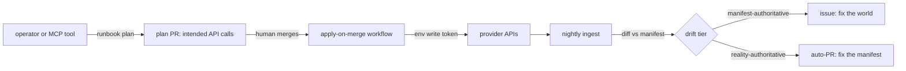

# rootsmith — Architecture Specification v0.3

*A Git-based control plane for a serial-venture digital footprint: declarative
asset registry, read-only reconciliation, and PR-gated mutation runbooks.
Spec date 2026-07-15. Targets: Vercel platform APIs, GitHub Actions, RDAP,
Node/TypeScript. Volatile claims carry as-of dates in the Appendix.*

---

## 0. Thesis and positioning

**What.** A single repository (`rootsmith/`) that holds the desired state of
every venture's digital assets — domains, DNS, repos, deploys, email routes —
diffs it nightly against observed reality, and executes changes only through
human-approved, PR-gated runbooks.

**For whom.** A single operator running a portfolio of small ventures
(currently ~13 domains, ~7 venture identities) with a serial spin-up/sunset
pattern.

**The positioning decision.** This is a **control plane, not an autopilot**,
and an **internal tool, not a product**. The expensive problem is knowing
current state and detecting drift, not executing changes; automated *decision*
authority is deliberately excluded. Productization is a deferred decision with
an explicit trigger (§6, O6) — no dashboard, no multi-tenancy, no SaaS
concerns before the trigger fires.

**Rejected positioning.** (a) Orchestration glue (sheet + n8n + reminders):
covers ~80% of value cheaply but cannot reconcile — the inventory rots — and
doesn't compound into one-command venture provisioning. (b) Full agentic
autopilot: cross-account automated decisions are where the blast radius lives;
rejected permanently, not deferred.

---

## 1. Design invariants

- **I1 — Manifest is the system of record.** Every owned asset appears in
  exactly one venture manifest under `ventures/`. An asset observed in a
  provider but absent from every manifest is drift, never tolerated silently.
- **I2 — Reads and writes are credential-separated.** Scheduled jobs hold
  read-only tokens. Write tokens exist only in the GitHub Actions `apply`
  environment, released solely by `apply-on-merge`.
- **I3 — Every mutation is a plan first.** Runbooks emit a human-readable PR
  describing each intended API call. Merging the PR *is* the approval; there
  is no other write path. The apply environment's required-reviewer rule is a
  second, free gate.
- **I4 — Reconcile only what is programmatically readable.** Social handles,
  analytics properties, and anything without a reliable read API are inert
  documentation fields — recorded, never drift-checked. Reconciling
  unreadable state is fiction.
- **I5 — Drift is two-tier.** Manifest-authoritative fields (managed DNS,
  redirect targets, repo archived-status): drift files an issue proposing to
  fix the world. Reality-authoritative fields (renewal dates, cert expiry,
  unmanifested assets): drift auto-PRs the manifest. Collapsing the tiers
  produces either manifest rot or fighting the registrar over facts it owns.
- **I6 — Provider volatility is isolated behind adapters, with RDAP as the
  universal degraded mode.** Any registrar or platform yanking API access
  (precedent: GoDaddy, May 2024) degrades that adapter to RDAP-only
  monitoring; the nightly run never breaks.
- **I7 — Identity and credentials are outside the automation path.** The
  registry records that accounts exist; a password manager holds access;
  humans execute credential operations. No exception is planned or plannable.

---

## 2. Structure

Target repository layout (prospective — normative, not yet generated):

```text
rootsmith/
  ventures/             # one YAML per venture — the system of record (I1)
  schema/               # JSON Schema; CI-validated on every PR
  ingest/
    vercel.ts           # domains, DNS zones, projects, renewals
    rdap.ts             # registrar-agnostic expiry/lock/registrar facts
    dns.ts              # queries authoritative NS directly, never provider APIs
    github.ts           # repo existence, archived-status, default branch
    crtsh.ts            # cert-transparency: forgotten subdomains, dangling CNAMEs
  reconcile/
    diff.ts             # two-tier drift classification (I5)
    report.ts           # deduped issues + auto-PRs, fingerprinted by asset+type
  runbooks/
    transfer-in.md      # manual runbook: registrar consolidation (M0.5)
    park.ts             # lowest blast radius; proves the gate machinery
    provision.ts        # venture new <name> — the compounding payoff
    sunset.ts           # destructive; built last, after months of gate trust
  mcp/server.ts         # read tools + open_runbook_plan only (I3)
  .github/workflows/
    drift-nightly.yml   # read token only (I2)
    apply-on-merge.yml  # apply environment, required reviewer (I2, I3)
```

**Rules that generate the structure.** One venture, one file — lifecycle
operations (park, provision, sunset) act on ventures, so venture is the unit,
not asset type. Ingest modules map one-to-one to volatile external surfaces
(§Appendix, isolation table). Runbooks are ordered in the tree by blast
radius, which is also their build order.

### Manifest schema (illustrative)

```yaml
# ventures/acme.yaml
name: acme
status: active            # active | parked | sunsetting | archived
domains:
  - name: acme.example
    registrar: vercel
    role: canonical       # canonical | redirect | parked
    renews: 2027-03-01    # reality-authoritative — reconciler maintains it
  - { name: acme-app.example, registrar: vercel, role: redirect, renews: 2027-03-01 }
repo: github.com/<owner>/acme
deploy: { provider: vercel, project: acme }
email: { provider: <O3>, routes: [hello@acme.example] }
social: { x: "@acme" }      # inert documentation field (I4)
dns_policy: managed         # managed = manifest is truth | observed = report-only
```

---

## 3. Interface contracts

### CLI

| Command | Effect | Exit |
|---|---|---|
| `rootsmith status` | Render manifest vs. observed state table | 0 always |
| `rootsmith drift` | List classified drift items | 0 clean, 1 drift |
| `rootsmith renewals --within 90d` | Upcoming renewals | 0 |
| `runbook plan <park\|provision\|sunset> <venture>` | Open plan PR; never executes | 0 on PR open |

Binary name `rootsmith`, shell alias `rsm` (`rs` collides with common tooling;
`root` is semantically loaded). MCP `serverInfo.name` is `rootsmith`.

### MCP server

Read tools: `get_venture`, `list_ventures`, `list_drift`,
`renewals_within(days)`. Exactly one write tool: `open_runbook_plan(runbook,
venture, params)` — opens a plan PR (I3). No tool applies anything.

### Compatibility posture

Strict on own surface: unknown fields in a venture manifest **fail CI**.
Tolerant on others': unknown fields in provider API responses are ignored;
missing expected fields degrade that adapter to RDAP mode with a logged
warning (I6), never a crashed run.

### Mutation flow

The one question this diagram answers: *how does a change to the world happen?*



---

## 4. Reconciliation and audit rules

**Ingest sources.** Vercel API (most current domains: registration,
renewal, DNS, projects); RDAP for all domains as the registrar-agnostic read
path; direct queries against authoritative nameservers for DNS actual-state
(provider-agnostic truth — never a provider API); GitHub API for repo state;
crt.sh for certificate-transparency subdomain discovery.

**Nightly audits, each filing a fingerprint-deduped issue:** renewals within
90 days; certificate expiry; DNS mismatch vs. manifest on `dns_policy:
managed` zones; assets observed but unmanifested (I1); dangling DNS records —
parked domains with stale CNAMEs are a subdomain-takeover vector, and a
defensive multi-TLD portfolio makes parked zones a certainty.

**Dedup rule.** Fingerprint = asset + drift type. New occurrence updates the
existing open issue; it never files a duplicate.

---

## 5. Sequencing and launch scope — the roadmap

Blast-radius ascending. Each milestone ships standalone value; each threshold
is the observable condition for "done."

| # | Milestone | Effort | Completion threshold |
|---|---|---|---|
| M0 | Repo, schema, backfill all 13 domains | 1 evening | CI validates manifests; `rootsmith renewals` answers from the manifest |
| M0.5 | Registrar consolidation (manual runbook) | ~1 week elapsed | All third-party domains registered at Vercel; legacy registrar accounts empty |
| M1 | Read-only ingest + `rootsmith status` | 1 weekend | Status table matches dashboards; RDAP coverage per TLD verified (O2) |
| M2 | Nightly drift + audits as issues | 2 evenings | One full week of nightly runs, zero duplicate issues, ≥1 true finding triaged |
| M3 | MCP server | 1 evening | Claude answers "what renews this quarter" from live data |
| M4 | `park` runbook — first write path | 1–2 evenings | One domain parked end-to-end via plan-PR → merge → apply |
| M5 | `provision` — `venture new <name>` | 2–3 evenings | New venture: domain, repo, deploy, DNS, email, manifest in one gated flow |
| M6 | `sunset` runbook | 1–2 evenings | One real venture unwound cleanly, assets released or parked per plan |
| — | Dashboard / productize decision | gate | Only after trigger in O6 |

**M0.5 transfer sequence (zero-downtime):** RDAP lookup on each third-party
domain — confirms registrar, expiry, lock (resolves O1);
move nameservers to Vercel DNS and verify resolution externally *before*
transferring registration (losing-registrar DNS hosting is not guaranteed to
survive transfer); unlock, pull auth codes, initiate at Vercel; confirm none
registered/transferred within 60 days (ICANN rule for gTLDs; ccTLDs have
their own regimes but the auth-code flow applies).

**Re-evaluation triggers that reorder the plan:** Vercel registrar
deprecation or TLD-support gap discovered in M0.5 → re-open the Cloudflare
alternative; RDAP gap on .ai (O2) → manual `renews` + `verify_by` fields
before M2 audits are trustworthy.

---

## 6. Open decisions

| # | Decision | Options | Recommendation | Resolving evidence | Owner |
|---|---|---|---|---|---|
| O1 | ~~Which registrar holds which third-party domain~~ **RESOLVED 2026-07-15** by RDAP + DoH NS lookups; per-domain specifics (registrars of record, one undelegated finding) recorded in the private ops fork | — | — | RDAP + DoH NS lookups, this date | Closed |
| O2 | ~~RDAP coverage per TLD~~ **RESOLVED 2026-07-15**: .tech/.com/.net/.app/.dev covered; .ai has RDAP but rate-limits hard (429s — adapter ships backoff + accept-stale); **.io has NO RDAP** (absent from IANA bootstrap) — manual `renews` + `verify_by`, or port-43 WHOIS from CI | — | — | Live queries + IANA dns.json, this date | Closed |
| O3 | Email provider per venture | Google Workspace / Vercel-adjacent routing / per-venture | Inventory first; likely Workspace | Account audit during M0 backfill | Operator |
| O4 | Defensive TLD portfolio (multiple variants of the flagship name) | Keep all defensively / drop secondary TLDs at renewal | Decide explicitly at first renewal issue; defensive is fine if chosen, not drifted into | M2 renewal issue, ~Apr 2027 | Operator |
| O5 | Uptime checks | In-repo HTTP checks / external monitor | Simple HTTP check in nightly for parked+redirect; external tool only for active products | M2 implementation | Operator |
| O6 | Productize | Internal forever / OSS / product | Defer; if it fires, decide then whether it ships as rootsmith or rebrands to the held product-name option (recorded privately) | Trigger: 3 months post-M4 dogfooding with weekly active use | Operator |
| O7 | Secret storage for apply path | GH environment secrets / 1Password service account | GH environment secrets now; revisit if secret count exceeds ~10 | M4 implementation | Operator |

## 7. Kill / pivot triggers

- **Change rate falsifier.** If observed portfolio change rate stays below
  ~5 meaningful changes/month for 3 consecutive months post-M2, the
  reconciler is over-engineering: decommission to a cron RDAP expiry check +
  static inventory (the rejected glue option becomes correct).
- **Noise falsifier.** If drift issues run >50% false positive over any
  month, freeze manifest-authoritative enforcement to report-only and fix
  classification before re-enabling.
- **Platform falsifier.** Vercel exits or degrades its registrar business →
  re-run the consolidation decision with Cloudflare as default; adapters
  (I6) bound the migration cost.

---

## Appendix — Ground truth, volatile facts, isolation

| Claim | Basis | As-of |
|---|---|---|
| GoDaddy Management/DNS API requires only 1 domain (was 10–50) | GoDaddy announcement, Apr 2026; verified by search | 2026-07-15 |
| GoDaddy cut off <50-domain accounts with ~1 day notice | Community reports, May 2024 | historical |
| Squarespace has no domains/DNS API; UI requires 2FA reauth per DNS edit | Squarespace docs + forum; verified by search | 2026-07-15 |
| Vercel API covers domains, renewals, DNS, projects | Training-vintage; verify SDK surface in M1 | flag |
| Vercel supports transfer-in for .ai/.io/.tech | Unverified — check dashboard before M0.5 step 3 | flag |
| .ai carries 2-year registration minimum | Training-vintage; dashboard shows actuals | flag |
| RDAP coverage for .ai/.tech | RESOLVED — see O2 | 2026-07-15 |
| A registrar dashboard showed expiry one day off from registry RDAP | RDAP is reality-authoritative; the manifest carries the registry date | 2026-07-15 |
| Per-domain ground truth: expiries, registrars of record, open findings | private ops fork — this public edition carries no portfolio facts | 2026-07-16 |

**Volatility isolation:** Vercel API surface → `ingest/vercel.ts`; registrar
policy churn → `ingest/rdap.ts` + adapter interface (I6); DNS truth →
`ingest/dns.ts` (authoritative NS only); GitHub API → `ingest/github.ts`;
cert transparency → `ingest/crtsh.ts`. Each volatile surface has exactly one
owning module.

**Decision record — naming (2026-07-15).** Tool is **rootsmith**: joins the
operator's existing -smith brand system (skillsmith, treesmith) and pairs
with treesmith — trees above, roots below; the substrate ventures grow from —
with the DNS root as a second reading. Rejected: *footprint* (generic, wins
neither the personal-brand nor the product case); *portsmith*,
*venturesmith* (unregistered check failed — both taken on .dev, registry
RDAP, 2026-07-15); *smithy* (AWS IDL collision), *smithery* (MCP-registry
collision); a found-word alternative was not rejected but **held privately as
the O6 product-name option** — a found word beats a surname compound for a
neutral product. Name is baked into MCP server name,
issue fingerprints, and workflow names at M3 — decided in time.

**Falsification note (pre-tag review).** Strongest counterargument to the
central choice remains the glue option — at 13 domains the reconciler may be
over-built; this is carried as a live kill trigger (§7) rather than argued
away. Crux per major decision: venture-as-unit stands or falls on lifecycle
operations being the dominant workflow (they are, per the serial-venture
pattern); PR-as-gate stands on GitHub environments being trustworthy as the
sole write gate (industry-standard; residual risk is operator merging
without reading, mitigated by required-reviewer). Confidence: architecture
**high**; that it beats glue for this operator **moderate** — driver is the
unmeasured change rate, which M2's first three months will measure.

*v0.1 (2026-07-15) — initial spec, as `footprint`.*
*v0.2 (2026-07-15) — renamed to `rootsmith`; CLI alias `rsm`; O6 updated to
carry a held product-name fork; naming decision record added.*
*v0.3 (2026-07-15) — scaffold shipped; M0 threshold met (schema-valid
manifests, `rootsmith renewals` live). O1, O2 resolved by live RDAP/DNS runs.
One renewal emergency and two registration findings opened — transfer-in
runbook lanes; specifics in the ops fork.*
*v0.4 (2026-07-16) — public edition: per-domain operational facts, findings,
and naming action items relocated to the private ops fork; `ventures/` ships
fictional RFC 2606 examples. Architecture unchanged.*
