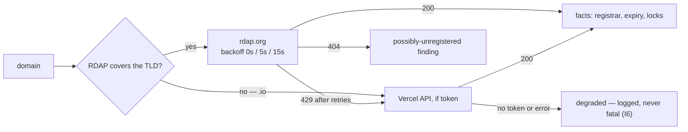

# Drift catalog

One audit pass — [`src/reconcile/collect.ts`](../src/reconcile/collect.ts) — is shared verbatim by `rsm drift`, the MCP `list_drift` tool, and the [nightly workflow](../.github/workflows/drift-nightly.yml). This page catalogs everything it can find, what triggers each finding, and where each one lands.

## Sources

Each volatile external surface has exactly one owning adapter (I6); a source that cannot attest returns `degraded` with a reason — it never throws, so the run never breaks.

| Source | Module | Endpoint | Auth | Coverage notes |
|:--|:--|:--|:--|:--|
| RDAP | [`ingest/rdap.ts`](../src/ingest/rdap.ts) | `rdap.org/domain/…` | none | no `.io` (absent from IANA bootstrap); `.ai` rate-limits hard |
| DNS | [`ingest/dns.ts`](../src/ingest/dns.ts) | `dns.google/resolve` (DoH) | none | NXDOMAIN is the pivot signal for two audits |
| Vercel | [`ingest/vercel.ts`](../src/ingest/vercel.ts) | `api.vercel.com/v5/domains` | `VERCEL_TOKEN` | expiry fallback + the account-wide domain list (I1) |
| GitHub | [`ingest/github.ts`](../src/ingest/github.ts) | `api.github.com` | `GH_REPOS_TOKEN` → `GITHUB_TOKEN` → `gh` | sweeps `affiliation=owner`; org repos looked up individually |
| crt.sh | [`ingest/crtsh.ts`](../src/ingest/crtsh.ts) | `crt.sh` JSON | none | `--deep` only; capped at 30 subdomains per domain |
| live TLS | [`ingest/cert.ts`](../src/ingest/cert.ts) | port 443 handshake | none | verification off on purpose — an expired cert must be *observable*, not a connection error |

Registry facts follow a fallback chain. The diagram answers: **which source attests a domain's registry facts?**



Live TLS reads the certificate actually being served — crt.sh shows issuance history, not what's on the wire today. DNS goes over DoH so the run behaves identically on laptops, CI, and sandboxes.

## The two tiers (I5)

Every finding is classified by **who owns the fact**, and the tier decides the fix direction:

| Tier | Owner of the fact | Destination |
|:--|:--|:--|
| `reality-authoritative` | the world (registries, providers) | when a mechanical manifest fix exists → **auto-PR**; otherwise an issue |
| `manifest-authoritative` | the manifest | **issue** proposing to fix the world |

## Domain findings

| Kind | Tier | Fires when | Lands as |
|:--|:--|:--|:--|
| `renews-mismatch` | reality | observed expiry ≠ manifest `renews` | auto-PR sets `renews` + `basis` |
| `renews-missing` | reality | expiry observed, manifest has none | auto-PR sets `renews` + `basis` |
| `renewal-window` / `EXPIRED` | reality | `renews` within the window (default 90d) / in the past | issue |
| `possibly-unregistered` | reality | RDAP 404 at a working registry endpoint | issue |
| `undelegated` | manifest | NXDOMAIN — no NS delegation at the registry | issue |
| `dns-mismatch` | manifest | `dns_policy: managed` zone serves records that don't match the manifest | issue, fingerprinted per `fqdn:type` |
| `cert-expiry` / `cert-expired` | manifest | live cert on an `active` venture's `canonical` domain within 14 days / past | issue |
| `dangling-cname` | manifest | `--deep`: a CT-known subdomain's CNAME target is NXDOMAIN | issue |
| `unmanifested-asset` | reality | domain in the Vercel account, absent from every manifest (I1) | auto-PR quarantines it in `ventures/unassigned.yaml` |

> [!WARNING]
> `dangling-cname` is the subdomain-takeover vector — a parked zone pointing a CNAME at a released target is claimable by anyone. A defensive multi-TLD portfolio makes parked zones a certainty, which is why the sweep exists.

## Repo findings

| Kind | Tier | Fires when | Lands as |
|:--|:--|:--|:--|
| `repo-duplicate-claim` | manifest | two ventures — or a venture *and* `repos.yaml` — claim one repo | issue |
| `repo-gone` | reality | a claimed or registry repo 404s at GitHub | issue |
| `repo-archived-mismatch` | manifest | venture `active`, repo archived | issue |
| `repo-unarchived-mismatch` | manifest | venture `archived`, repo live | issue |
| `repo-archive-pending` | manifest | `disposition: archive`, repo not archived | issue — converged by [`archive-repos`](./runbooks.md#archive-repos) |
| `repo-keep-archived` | manifest | `disposition: keep`, repo archived | issue |
| `repo-unmanifested` | reality | owned repo with no claim and no registry entry (I1) | auto-PR quarantines it in `repos.yaml` as `unassigned` |

## Where findings land

**Issues** — filed under the `drift` label with an invisible fingerprint marker in the body:

```html
<!-- rootsmith:fingerprint=acme.example:renewal-window -->
```

The fingerprint is `asset:kind`. On re-occurrence the open issue is `PATCH`ed in place — the nightly run never files a duplicate (spec §4). Closing a manifest-authoritative issue means changing reality (or explicitly amending the manifest), not ignoring it.

**Auto-PRs** — reality-authoritative findings that carry a mechanical fix become a branch named `rootsmith/fix/<fingerprint>`, committed by pure git plumbing (the checkout is never touched, so this works from a detached Actions HEAD), and opened as a PR that is likewise updated in place per head branch. The edit is format-preserving: comments and dated notes in the manifest survive.

> [!NOTE]
> PRs opened with `github.token` do not trigger CI on themselves — GitHub's workflow-loop guard. CI runs when a human pushes to or reopens the auto-PR; the nightly job itself goes red only when the reconcile machinery breaks, because the issues and PRs *are* the signal.

## Degraded mode

Missing credentials or unreachable sources shrink coverage, never break the run (I6). Degradations are printed to stderr and returned by the MCP tool:

```text
  degraded: acme.example: rdap degraded — NOT FOUND at registry — domain may be unregistered
  degraded: vercel domain list — VERCEL_TOKEN not set (unmanifested-asset audit skipped)
```

(A real `.io` domain degrades as `no RDAP coverage` — the TLD is absent from the IANA bootstrap entirely.)

With no GitHub token at all, `--report` itself degrades: findings print as a markdown table on stdout instead of filing anything. The full token-by-token matrix is in [setup.md](./setup.md#degradation-matrix).

## Thresholds

| Constant | Value | Where |
|:--|:--|:--|
| renewal window | 90 days (`--within` overrides) | `collect.ts` |
| cert warning | ≤ 14 days remaining | `collect.ts` |
| CT subdomains per domain | 30 | `collect.ts` |
| RDAP retry backoff | 0s, 5s, 15s | `rdap.ts` |
| unassigned-domain `verify_by` | +14 days | `collect.ts` |

---

← [README](../README.md) · [docs index](./README.md)
