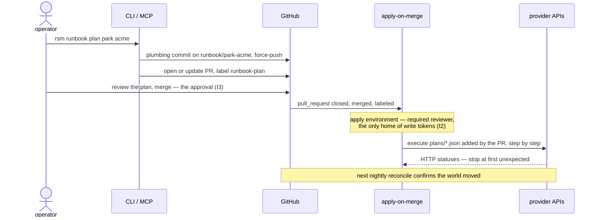

# Runbooks — the gated write path

Every mutation is a plan first (I3): a runbook computes the exact API calls it intends to make, commits them as JSON alongside the matching manifest edits, and opens a PR. Nothing executes until a human merges. The diagram answers: **who does what, in what order, from intent to applied change?**



Three gates stack on the path, each free: the PR review itself, the `runbook-plan` label + merged check in [the workflow's `if`](../.github/workflows/apply-on-merge.yml), and the `apply` environment's required-reviewer rule.

## Anatomy of a plan

`runbook plan` writes `plans/<venture>-<runbook>-<date>.json` to a `runbook/<runbook>-<venture>` branch — built by pure git plumbing, so your working tree, index, and current branch are never touched. A step:

```json
{
  "id": 2,
  "provider": "vercel",
  "description": "detach acme.example from Vercel project acme (registration retained; 404 tolerated = already detached)",
  "call": {
    "method": "DELETE",
    "url": "https://api.vercel.com/v9/projects/acme/domains/acme.example",
    "tokenEnv": "VERCEL_TOKEN"
  },
  "expect": [200, 204, 404]
}
```

| Field | Meaning |
|:--|:--|
| `call` | the literal HTTP request; **absent = manual step**, executed by the operator outside the write path (I7) |
| `call.tokenEnv` | which `apply`-environment variable holds the write token (I2) |
| `expect` | acceptable HTTP statuses; default any 2xx — park tolerates 404 so re-applies are idempotent |
| `destructive` | irreversible or money-spending — rendered **loudly** in the PR |

The PR body renders the same plan for humans: a summary table of every intended call, each step in full with its verbatim request, manual steps as a checklist, the manifest edits riding in the PR, and the runbook's notes. Manifest edits travel in the *same* PR as the world-mutation steps — map and territory change together.

## The four runbooks

### `park`

```sh
rsm runbook plan park <venture>
```

The lowest-blast-radius runbook, built first to prove the gate machinery (M4). Detaches every domain from the venture's Vercel project and flips the manifest (`status: parked`, every role → `parked`). Registration is always retained — renewal audits keep running against parked domains. Fully reversible: re-add the domains to a project and flip the manifest back.

When the manifest lists email routes, the plan opens with a manual step: confirm mail is migrated or intentionally dropped **before** merging — email breaks silently.

### `provision`

```sh
rsm runbook plan provision <name> --domain <fqdn> [--repo <name>] [--project <name>]
```

`venture new` — the compounding payoff (M5). Plans, in order: register the domain at Vercel, create a private GitHub repo, create the Vercel project, attach the domain, then two manual steps (dashboard repo-link, email routing per open decision O3). The new `ventures/<name>.yaml` rides in the plan PR.

> [!CAUTION]
> Step 1 **spends money** and cannot be un-spent — it is marked `destructive`, and the required-reviewer gate on the `apply` environment exists for exactly this merge. The registration endpoint is training-vintage: verify the price in the dashboard before merging.

The manifest lands with `renews` unset *on purpose*: the first nightly run auto-PRs the registry value in, proving the reconciliation loop end-to-end on day one.

### `sunset`

```sh
rsm runbook plan sunset <venture> [--release]
```

The destructive runbook, built last by design (M6) — it ships only after months of gate trust. Plans: a manual export-first step (env vars, data, mail archives — after apply, the deploy is gone), archive the repo (reversible), detach every domain, **delete the Vercel project** (destructive: deployments, env vars, logs), and flip the manifest to `status: archived` with every role parked.

Registration deletion is **never** automated (I7). By default domains stay registered and parked; with `--release`, the plan adds a manual step to disable auto-renew at the registrar and let them lapse by human hand.

### `archive-repos`

```sh
rsm runbook plan archive-repos
```

Registry-scoped, not venture-scoped: reads every `repos.yaml` entry with `disposition: archive`, checks current GitHub state, and plans a `PATCH archived: true` for each one not yet converged. Carries no manifest edits — desired state already lives in the registry (I5) — and refuses to open an empty plan. Archiving is reversible in repo settings; the nightly audit confirms convergence after apply.

## Apply semantics

[`apply-on-merge`](../.github/workflows/apply-on-merge.yml) fires when a merged PR carries the `runbook-plan` label, checks out the merge commit, and executes every `plans/*.json` file **added** by that PR — exactly the reviewed steps, nothing re-planned. Per step:

1. Resolve the write token named by `tokenEnv` — missing means fail immediately (I2: those tokens exist only here).
2. Issue the literal request.
3. Compare the status against `expect` (default: any 2xx). **First unexpected status stops the run** — a half-applied plan must *look* half-applied, and the nightly reconcile will surface whatever state it left behind.
4. Manual steps are echoed as an operator checklist, never executed.

## The manual runbook

[`runbooks/transfer-in.md`](../runbooks/transfer-in.md) is the M0.5 registrar consolidation — deliberately human-executed (credential operations are outside the automation path, I7) and the dress rehearsal for the gated ones. The public copy is a template with three lanes — **emergency** (domain expiring soon at a registrar you're leaving), **standard** (no known pressure), and **investigation** (NXDOMAIN / RDAP-404 findings); a deployment's ops fork carries the live lanes with real domains, dates, and decision gates. The zero-downtime rule throughout: move DNS hosting and verify resolution *before* transferring registration.

---

← [README](../README.md) · [docs index](./README.md)
